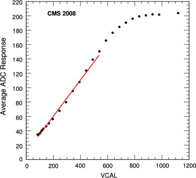
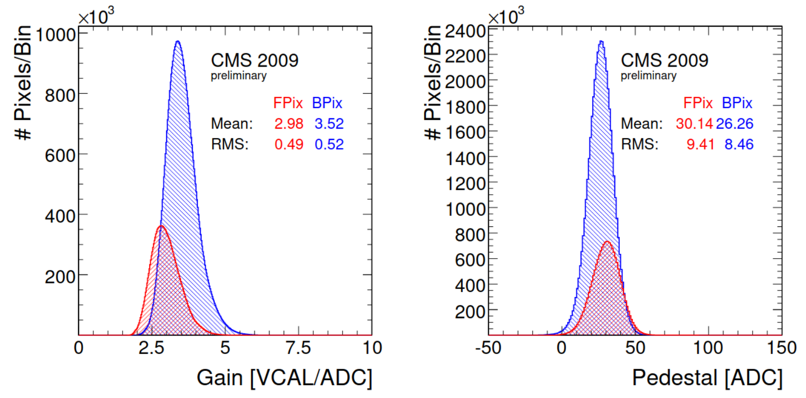
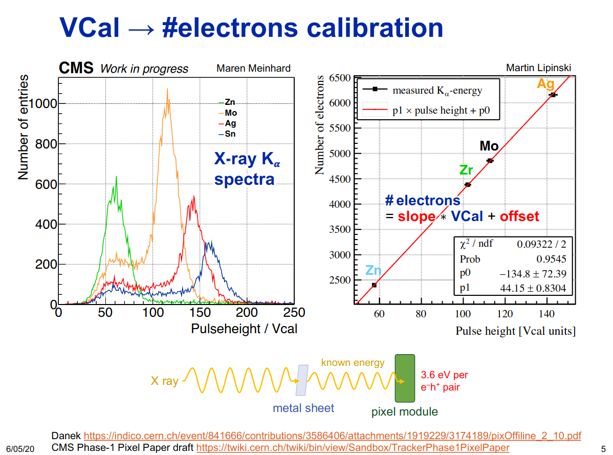

# gpuCalibPixel.h - calibPixels

The whole kernel:

```cuda linenums="1"
  template <bool isRun2>
  __global__ void calibDigis(uint16_t* id,
                             uint16_t const* __restrict__ x,
                             uint16_t const* __restrict__ y,
                             uint16_t* adc,
                             SiPixelGainForHLTonGPU const* __restrict__ ped,
                             int numElements,
                             uint32_t* __restrict__ moduleStart,        // just to zero first
                             uint32_t* __restrict__ nClustersInModule,  // just to zero them
                             uint32_t* __restrict__ clusModuleStart     // just to zero first
  ) {
    int first = blockDim.x * blockIdx.x + threadIdx.x;

    // zero for next kernels...
    if (0 == first)
      clusModuleStart[0] = moduleStart[0] = 0;
    for (int i = first; i < phase1PixelTopology::numberOfModules; i += gridDim.x * blockDim.x) {
      nClustersInModule[i] = 0;
    }

    for (int i = first; i < numElements; i += gridDim.x * blockDim.x) {
      if (invalidModuleId == id[i])
        continue;

      bool isDeadColumn = false, isNoisyColumn = false;

      int row = x[i];
      int col = y[i];
      auto ret = ped->getPedAndGain(id[i], col, row, isDeadColumn, isNoisyColumn);
      float pedestal = ret.first;
      float gain = ret.second;
      // float pedestal = 0; float gain = 1.;
      if (isDeadColumn | isNoisyColumn) {
        printf("bad pixel at %d in %d\n", i, id[i]);
        id[i] = invalidModuleId;
        adc[i] = 0;
      } else {
        float vcal = float(adc[i]) * gain - pedestal * gain;
        if constexpr (isRun2) {
          float conversionFactor = id[i] < 96 ? VCaltoElectronGain_L1 : VCaltoElectronGain;
          float offset = id[i] < 96 ? VCaltoElectronOffset_L1 : VCaltoElectronOffset;
          vcal = vcal * conversionFactor + offset;
        }
        adc[i] = std::max(100, int(vcal));
      }
    }
  }
```


## 1. Init

This part of the code has nothing to do with calibrating pixels. We're initialising `clusModuleStart` and `moduleStart` as well as `nClustersInModule`. Even if we have effectively zero digis in this event we still need to call this kernel for these initialisations to happen. 

``` cuda linenums="14"
// zero for next kernels...
if (0 == first)
    clusModuleStart[0] = moduleStart[0] = 0;
for (int i = first; i < phase1PixelTopology::numberOfModules; i += gridDim.x * blockDim.x) {
    nClustersInModule[i] = 0;
}
```

## 2. ADC to VCAL

Converting from `ADC` to `VCAL`:

``` cuda linenums="29"
auto ret = ped->getPedAndGain(id[i], col, row, isDeadColumn, isNoisyColumn);
float pedestal = ret.first;
float gain = ret.second;
```

...

``` cuda linenums="38"
float vcal = float(adc[i]) * gain - pedestal * gain;
```

Note that to determine the `gain` and `pedestal` values the inverse of them is measured. This is done by injecting different `VCAL` values to the detector and measuring the `ADC` response.

!!! quote "From Offline calibrations and performance of the CMS pixel detector [#1]"

    In the second step of the ADC-to-charge calibration, a polynomial of first degree is fit to the ADC vs
    charge measurements. The fit is performed in a restricted VCAL range to minimize the influence of the
    non-linearities at high charge. The resulting two parameters (gain and pedestal) are displayed in Fig. 2 as
    obtained in a calibration run from October 2009. The
    gain is the inverse slope and the pedestal is the offset
    in Fig. 1. The parameters are very stable and are determined about every four months for control purposes.

<figure markdown>

<figcaption>Figure 1. Example ADC response as a function of injected charge in
VCAL units (see text for conversion to electrons). The red line is a
first degree polynomial fit to the data in a restricted VCAL range 
<a href=https://doi.org/10.1016/j.nima.2010.11.188>https://doi.org/10.1016/j.nima.2010.11.188</a>
</figcaption>
</figure>

<figure markdown>

<figcaption>Figure 2. Distributions of the gain and pedestal constants for each
pixel as obtained in a dedicated calibration run in October 2009.
<a href=https://doi.org/10.1016/j.nima.2010.11.188>https://doi.org/10.1016/j.nima.2010.11.188</a>
</figcaption>
</figure>

Some more recent slides from [https://indico.cern.ch/event/914013/#10-gain-calibration-for-run3-p](https://indico.cern.ch/event/914013/#10-gain-calibration-for-run3-p):


## 3. VCAL to electrons (charge)

``` cuda linenums="39" title="VCAL to charge conversion (up to Run2)"
if constexpr (isRun2) {
    float conversionFactor = id[i] < 96 ? VCaltoElectronGain_L1 : VCaltoElectronGain;
    float offset = id[i] < 96 ? VCaltoElectronOffset_L1 : VCaltoElectronOffset;
    vcal = vcal * conversionFactor + offset;
}
```

!!! quote "From Offline calibrations and performance of the CMS pixel detector [#1]"

    The ADC-to-charge calibration proceeds in two steps. First, in a dedicated standalone calibration run
    (3–6 hour duration, depending on the setup) of the pixel detector, all pixels are subject to charge injection
    from around 4000 electrons into the saturation regime
    (> 50000 electrons). ... The charge injection is controlled by a digital-to-analog-converter
    called VCAL. The relation between VCAL and injected charge Q in electrons, Q = 65.5×VCAL−414, has been
    obtained from dedicated x-ray source calibrations with
    variable x-ray energies (17.44 keV from Mo, 22.10 keV from Ag, and 32.06 keV from Ba, excited from a primary Am source).

To us, the linear relationship is relevant here `Q = 65.5×VCAL−414`.



!!! tip "Note the difference between Run2 and afterwards"

    Gain calibration has changed from Run3, for more information read the following resources:

    **PRs:**

    [ pixel mc gain calibration scheme: new GTs for MC Run3, modified Clusterizer conditions for Run3 #29333](https://github.com/cms-sw/cmssw/pull/29333)

    [ Add SiPixelVCal DB object for pixel gain calibration #29829](https://github.com/cms-sw/cmssw/pull/29829)

    **Presentations:**

    [https://indico.cern.ch/event/879470/contributions/3796405/attachments/2009273/3356603/pix_off_25_3_gain_calibration_mc.pdf](https://indico.cern.ch/event/879470/contributions/3796405/attachments/2009273/3356603/pix_off_25_3_gain_calibration_mc.pdf)

    From this presentation:

    For the phase1 pixels the MC gain constants used to be:

    `gains = 3.17 (0.055)`

    `pedestal = 16.3 (5.4)`

    same for bpix & fpix.

    After the inclusion of the vcal calibration they become:

    `gains = 149(2.6) for L1 158.6(2.8)`

    `pedestal = 16.7 (5.4) for L1 20.5(5.4)`

    ``` py
    from Configuration.Eras.Modifier_run3_common_cff import run3_common
    run3_common.toModify(siPixelClusters,
        VCaltoElectronGain = 1, # all gains=1, pedestals=0
        VCaltoElectronGain_L1 = 1, #
        VCaltoElectronOffset = 0, #
        VCaltoElectronOffset_L1 = 0 #
    )
    ```

    Practically speaking, we're combining the two linear models, `ADC to VCAL` and `VCAL to #electrons` into 1 linear model. So afterwards, our `VCAL to electron` conversion is only defined for backwards compatibility, it is not used/executed, it doesn't do anything. (`slope=1, offset=0`)

## 4. min electron cut

``` cuda linenums="44" title="minumum electron value becomes 100"
adc[i] = std::max(100, int(vcal));
```

This is also present in the legacy code.

## 5. Conclusion

From the high level overview, we calculate the charge (#electrons) for some pixel hit. 

We receive an `ADC` value at a specific `x`, `y` coordinate in a specific module `id[i]`, perform the gain calibration `ADC->VCAL and VCAL->electrons` (or `ADC->electrons`).

!!! warning "Output #electrons in `adc` array"

    We store the output, `#electrons` in the same storage that we had for input `ADCs`, the `adc` array.

## Citations

[#1]
Urs Langenegger,
Offline calibrations and performance of the CMS pixel detector,
Nuclear Instruments and Methods in Physics Research Section A: Accelerators, Spectrometers, Detectors and Associated Equipment,
Volume 650, Issue 1,
2011,
Pages 25-29,
ISSN 0168-9002,
https://doi.org/10.1016/j.nima.2010.11.188.
(https://www.sciencedirect.com/science/article/pii/S0168900210027385)
Abstract: The CMS pixel detector, divided into barrel and endcap subdetectors, has 66 million pixels. We present the offline algorithms and results for the gain/pedestal and Lorentz angle calibrations. The determination of the optimal clock delay settings with initial data is described. The expected detector performance from Monte Carlo simulations is compared to the real performance in 7TeV proton–proton collisions.
Keywords: Pixel detectors; Calibrations; CMS experiment; LHC detectors