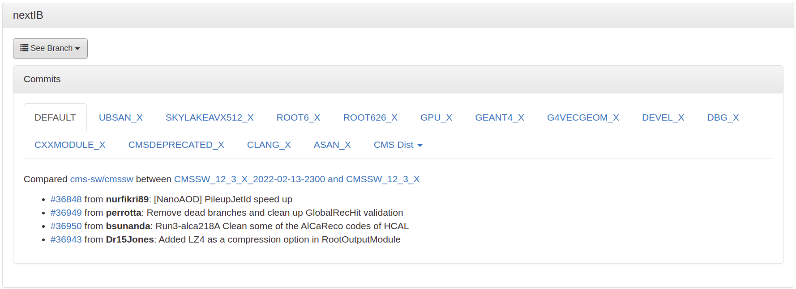

# General CMSSW developer guide

## Tutorial: proposing changes to CMSSW

**Based on [http://cms-sw.github.io/tutorial.html](http://cms-sw.github.io/tutorial.html)**

### Before you start

Please make sure you registered to GitHub and that you have provided them a ssh public key to access your private repository.

### Search for available releases

Before setting up a release search for available ones:

``` bash
scram list CMSSW
```

This should result in some output like:
```

Listing installed projects available for platform >> slc7_amd64_gcc10 <<

--------------------------------------------------------------------------------
| Project Name  | Project Version          | Project Location                  |
--------------------------------------------------------------------------------

  CMSSW           CMSSW_12_0_0_pre3          
                                         --> /cvmfs/cms.cern.ch/slc7_amd64_gcc10/cms/cmssw/CMSSW_12_0_0_pre3
  CMSSW           CMSSW_12_0_0_pre4          
                                         --> /cvmfs/cms.cern.ch/slc7_amd64_gcc10/cms/cmssw/CMSSW_12_0_0_pre4
  CMSSW           CMSSW_12_0_0_pre5          
                                         --> /cvmfs/cms.cern.ch/slc7_amd64_gcc10/cms/cmssw/CMSSW_12_0_0_pre5
...
  CMSSW           CMSSW_12_3_DBG_X_2022-02-10-2300  
                                         --> /cvmfs/cms-ib.cern.ch/week1/slc7_amd64_gcc10/cms/cmssw/CMSSW_12_3_DBG_X_2022-02-10-2300
  CMSSW           CMSSW_12_3_SKYLAKEAVX512_X_2022-02-10-2300  
                                         --> /cvmfs/cms-ib.cern.ch/week1/slc7_amd64_gcc10/cms/cmssw/CMSSW_12_3_SKYLAKEAVX512_X_2022-02-10-2300
  CMSSW           CMSSW_12_3_X_2022-02-11-1100  
                                         --> /cvmfs/cms-ib.cern.ch/week1/slc7_amd64_gcc10/cms/cmssw-patch/CMSSW_12_3_X_2022-02-11-1100
```

### Create a CMSSW area

Set up the work area just like you used to.

``` bash
cmsrel CMSSW_12_3_X_2022-02-11-1100
cd CMSSW_12_3_X_2022-02-11-1100/src
cmsenv
```

### init git area

``` bash
git cms-init --upstream-only
```

### Checkout a few packages using git cms-addpkg

Some useful packages for developing the *pixel local reconstruction in CUDA*:

```
CUDADataFormats/SiPixelCluster/
CUDADataFormats/SiPixelDigi/
RecoLocalTracker/SiPixelClusterizer/
```

You can add these packages with **cms-addpkg**:

(You need to be in the `CMSSW_12_3_X_2022-02-11-1100/src` repository)

``` bash
git cms-addpkg CUDADataFormats/SiPixelCluster/
git cms-addpkg CUDADataFormats/SiPixelDigi/
git cms-addpkg RecoLocalTracker/SiPixelClusterizer/
```

See the checked out packages in `.git/info/sparse-checkout`

``` bash title="Output of cat .git/info/sparse-checkout"
/.clang-format
/.clang-tidy
/.gitignore
/CUDADataFormats/SiPixelCluster/
/CUDADataFormats/SiPixelDigi/
/RecoLocalTracker/SiPixelClusterizer/
```

Only build the desired packages, **add/remove** unwanted ones:  
[http://cms-sw.github.io/git-cms-addpkg.html](http://cms-sw.github.io/git-cms-addpkg.html)

**Fetch updates from remote**
```sh
git checkout master
git fetch [official-cmssw]
git merge official-cmssw/master master
```

Where *official-cmssw* is the remote name configured for [the CMSSW offline software repository](https://github.com/cms-sw/cmssw).

You can list your remote repositories with (for even more verbose output, you can stack the v-s):
```sh
git remote -v
```

**Conflict after PR**  
To resolve a conflict that appeared after proposing the changes in a PR, one should prefer **rebase** to **merge** as it keeps the commit history clean.

For a rebase, do:

```sh
git checkout <development_branch_name>
git fetch
git rebase -i <CMSSW_current_release>
```

It might be, that the tags for branches are only considered for your **default remote**, eg. my-cmssw, but the current release of CMSSW is not included in that. To resolve this, you can also try specifying the remote for the **official cmssw** (which is not a fork):

```sh
git rebase -i <official_cmssw_name>/<CMSSW_current_release>
```

### Build release

``` bash
scram b -j
```

Doing a `DEBUG` build for `GPU` development:

``` bash
USER_CXXFLAGS="-g -DGPU_DEBUG -DEDM_ML_DEBUG" scram b -j
```

If your debug build is not working, you might need to clean your development area:
``` bash
scram b clean
```

### Before making a PR

``` bash
scram b code-format # run clang-format
scram b code-checks # run clang-tidy
```

## Build types:

1. Stable and pre-releases

Find out what's new in a particular release: [https://cmssdt.cern.ch/SDT/ReleaseNotes/index.html](https://cmssdt.cern.ch/SDT/ReleaseNotes/index.html).

For example for 

CMSSW_12_3_0_pre2
Changes since CMSSW_12_3_0_pre1:

[compare to previous](https://github.com/cms-sw/cmssw/compare/CMSSW_12_3_0_pre1...CMSSW_12_3_0_pre2)

[36515](http://github.com/cms-sw/cmssw/pull/36515) from **@cms-tsg-storm:** Revert EI removal in TSG tests `hlt` created: 2021-12-16 07:48:39 merged: 2021-12-16 09:48:40

[36506](http://github.com/cms-sw/cmssw/pull/36506) from **@bsunanda:** Run3-TB64 Make some simple changes to the classes in SimG4CMS/HcalTestBeam `simulation` created: 2021-12-15 15:29:55 merged: 2021-12-16 07:05:18

[36505](http://github.com/cms-sw/cmssw/pull/36505) from **@kpedro88:** restrict number of events for 0T PU workflows `pdmv` `upgrade` created: 2021-12-15 10:28:32 merged: 2021-12-15 14:50:12

etc.

[https://cmssdt.cern.ch/SDT/ReleaseNotes/CMSSW_12/CMSSW_12_3_0_pre2.html](https://cmssdt.cern.ch/SDT/ReleaseNotes/CMSSW_12/CMSSW_12_3_0_pre2.html)

2. Integration builds

Browse available integration builds, profiling and other test results: [https://cmssdt.cern.ch/SDT/html/cmssdt-ib/](https://cmssdt.cern.ch/SDT/html/cmssdt-ib/).

Important features include the ability to filter `IBs` based on

* Flavor
* OS
* CPU architecture
* Compiler


Look at latest commits, PRs added for a particluar build

