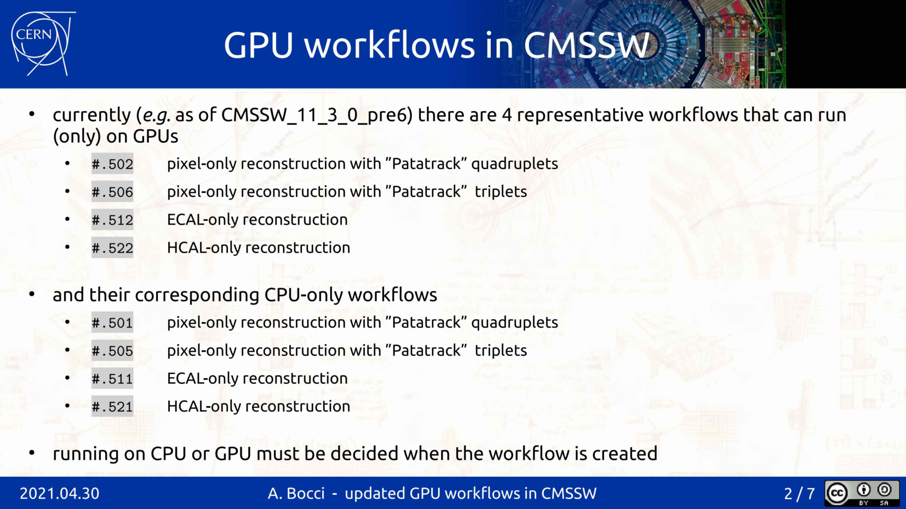

# Workflows

Following is the evolution of GPU workflows in `CMSSW` with events (`PR`s, presentations) more or less in chronological order.

## Early days

Very early spots and historical versions can be discovered in [the Patatrack fork of CMSSW](https://github.com/cms-patatrack/cmssw).

Some of the `PR`s concerned here are, but are not limited to (based on [#31854 description](https://github.com/cms-sw/cmssw/pull/31854)):

* [Add workflows for Riemann fit and GPU cms-patatrack/cmssw#20](https://github.com/cms-patatrack/cmssw/pull/20) Add workflows for Riemann fit and GPU
* [Add a DQM sequence for pixel-only tracking cms-patatrack/cmssw#23](https://github.com/cms-patatrack/cmssw/pull/23) Add a DQM sequence for pixel-only tracking
* [Riemann fit gpu cms-patatrack/cmssw#60](https://github.com/cms-patatrack/cmssw/pull/60) Port the Riemann fit to CUDA
* [Add pixel tracking workflows for data cms-patatrack/cmssw#144](https://github.com/cms-patatrack/cmssw/pull/144) Add pixel tracking workflows for data
* [Renumber GPU workflows cms-patatrack/cmssw#259](https://github.com/cms-patatrack/cmssw/pull/259) Change GPU workflow numbering: .7->.51, .8->.52, .9->.53
* [Tracking developments for review and merging cms-patatrack/cmssw#338](https://github.com/cms-patatrack/cmssw/pull/338) Rework the Riemann fit and broken line fit
* [Updating RelVal WF & customisation on CPU cms-patatrack/cmssw#549](https://github.com/cms-patatrack/cmssw/pull/549) Update the RelVal workflows and the CPU

## Towards integration in CMSSW

### 1. Add Patatrack process modifiers and workflows [#28522](https://github.com/cms-sw/cmssw/pull/28522)

**fwyzard commented on Dec 2, 2019**

**PR description:**
Add the pixelNtupleFit process modifier, that will be used to customise the Pixel-only tracks to use the ntuplet fit developed as part of the Patatrack workflows.

Add the "gpu" process modifer, that can be used to enable offloading of available modules to run on GPUs.

Add the first Patatrack workflows (currently just a placeholder).

### 2. Patatrack integration in CMSSW, A. Bocci, [Reconstruction meeting, 2020.03.20.](https://indico.cern.ch/event/898980/contributions/3788834/attachments/2006891/3351927/Patatrack_integration.pdf)

Relevant slide:


## Begin integration in CMSSW

### Patatrack integration - Pixel workflows (12/N) [#31854](https://github.com/cms-sw/cmssw/pull/31854)

** Merged silviodonato merged 54 commits into cms-sw:master from cms-patatrack:patatrack_integration_12_N_pixel_workflows on Apr 12, 2021**

**fwyzard commented on Oct 19, 2020**

**PR description:**
Update the `runTheMatrix.py` workflows for pixel-only tracking:

* `###.501`: pixel-only quadruplets on CPU
* `###.502`: pixel-only quadruplets on GPU
* `###.505`: pixel-only triplets on CPU
* `###.506`: pixel-only triplets on GPU

## Redesign

Once the main `PR` originating from `cms-patatrack/cms-sw` has been merged, different redesigns happened:

### 1. Redesign all GPU workflows to detect if a GPU is present, and fall back to CPU otherwise [#33428](https://github.com/cms-sw/cmssw/pull/33428)
**Merged cmsbuild merged 11 commits into cms-sw:master from fwyzard:auto_gpu_workflows on May 11, 2021**

**fwyzard commented on Apr 14, 2021**

**PR description:**

Redesign the GPU workflows:

* the CPU (*e.g. ###.501) and GPU (###.502) workflows should now be as close as possible;
* the implementation of the CPU and GPU workflows has been simplified;
* all GPU workflows use the SwitchProducerCUDA mechanism to detect if a GPU is available and offload a module or task to the GPU; if not, they automatically fall back to the equivalent CPU modules and tasks;
* when the "gpu" modifier is used, the pixel local reconstruction workflow used the "HLT" payload type both on the CPU and on the GPU, for better consistency of the results;
* the "Patatrack" pixel tracks reconstruction on CPU is based on a modifier (pixelNtupletFit) instead of a customisation, in line with the other workflows;
* the HCAL-only workflows should follow more closely the implementation of the general reconstruction sequence, both for Run 2 (2018) and Run 3 scenarios.

Some changes to the relevant EDProducers have made the definition of the workflows easier:

* the SoA-to-legacy HCAL rechit producer has been updated to make the production of the SoA and/or legacy collections optional;
* the legacy ECAL unpacker has been updated to declare only the event products it will actually produce;
* the default labels used in many modules have been updated to reflect the labels used in the configuration.

Some other general changes and code clean up:

* remove some no-longer-used files as well as some commented-out code
* always clone() a module used in a SwitchProducerCUDA
* move the implementation of the gpuVertexFinder kernels from gpuVertexFinderImpl.h to gpuVertexFinder.cc

The update has been presented here: [https://indico.cern.ch/event/1033022/#47-gpu-workflows](https://indico.cern.ch/event/1033022/#47-gpu-workflows).

### 2. updated GPU workflows in CMSSW, A. Bocci, [Reconstruction and Analysis Tools meeting, 2021.04.30.](https://indico.cern.ch/event/1033022/contributions/4338291/attachments/2236780/3791913/updated%20GPU%20workflows%20in%20CMSSW.pdf)

Relevant slides:




### 3. Update GPU workflows [#35331](https://github.com/cms-sw/cmssw/pull/35331)

**Merged cmsbuild merged 4 commits into cms-sw:master from fwyzard:update_GPU_workflows_121x on Sep 24, 2021**

**fwyzard commented on Sep 18, 2021**

**PR description:**

Add new GPU workflows, that run the Patatrack pixel local and pixel-only track reconstruction in addition to the full reconstruction, with the possibility of offloading to GPUs also the ECAL and HCAL local reconstruction.

**PR validation:**

Validated with

``` sh
runTheMatrix.py -w upgrade -j 4 -t 8 -l 11634.591,11634.592,11634.595,11634.596
...
Running up to 4 concurrent jobs, each with 8 threads per process
...
11634.591_TTbar_14TeV+2021_Patatrack_CPU+TTbar_14TeV_TuneCP5_GenSim+Digi+Reco+HARVEST Step0-PASSED Step1-PASSED Step2-PASSED Step3-PASSED  - time date Sat Sep 18 12:26:05 2021-date Sat Sep 18 12:21:24 2021; exit: 0 0 0 0
11634.592_TTbar_14TeV+2021_Patatrack_GPU+TTbar_14TeV_TuneCP5_GenSim+Digi+Reco+HARVEST Step0-PASSED Step1-PASSED Step2-PASSED Step3-PASSED  - time date Sat Sep 18 12:26:12 2021-date Sat Sep 18 12:21:25 2021; exit: 0 0 0 0
11634.595_TTbar_14TeV+2021_Patatrack_TripletsCPU+TTbar_14TeV_TuneCP5_GenSim+Digi+Reco+HARVEST Step0-PASSED Step1-PASSED Step2-PASSED Step3-PASSED  - time date Sat Sep 18 12:26:15 2021-date Sat Sep 18 12:21:25 2021; exit: 0 0 0 0
11634.596_TTbar_14TeV+2021_Patatrack_TripletsGPU+TTbar_14TeV_TuneCP5_GenSim+Digi+Reco+HARVEST Step0-PASSED Step1-PASSED Step2-PASSED Step3-PASSED  - time date Sat Sep 18 12:26:10 2021-date Sat Sep 18 12:21:26 2021; exit: 0 0 0 0
4 4 4 4 tests passed, 0 0 0 0 failed
```

### 4. Add workflows for profiling the GPU code [#35540](https://github.com/cms-sw/cmssw/pull/35540)

**Merged cmsbuild merged 2 commits into cms-sw:master from fwyzard:add_GPU_profiling_workflows on Oct 8, 2021**

**fwyzard commented on Oct 5, 2021**

**PR description:**

Add four workflows for profiling the GPU code:

* .504 Pixel-only local reconstruction and quadruplets
* .508 Pixel-only local reconstruction and triplets
* .514 ECAL-only local reconstruction
* .524 ECAL-only local reconstruction

The workflows explicitly consume the GPU products, so they can only run on a GPU-equipped machine.

The transfer to the host and the conversion to the legacy format is not run.

**PR validation:**

Used to profile the various workflows on top of CMSSW_12_1_0_pre3, runing over that release's TTbar relvals with pileup:

| **measurement**	| **CMSSW_12_1_0_pre3** |
|---------------|-------------------|
| I/O throughput	| ~ 2 kev/s | 
| `11634.504`	| 1071 ± 3 ev/s | 
| `11634.508`	| 560 ± 2 ev/s | 
| `11634.514`	| 1391 ± 5 ev/s | 
| `11634.524`	| 1354 ± 10 ev/s | 

## Fixes

### 1. Fix the Patatrack pixel local reconstruction running on CPU [#35915](https://github.com/cms-sw/cmssw/pull/35915)

**Merged cmsbuild merged 1 commit into cms-sw:master from fwyzard:fix_hltSiPixelRecHitSoA_121x on Nov 1, 2021**

**fwyzard commented on Oct 29, 2021**

**PR description:**

Use the hltSiPixelRecHitSoA producer for the pixel rechits in legacy and SoA format, instead of running the legacy producer.

**PR validation:**
Successfully run the GPU workflow 11634.506.

## Current status

### runTheMatrix.py

List available workflows for gpu:

``` sh
runTheMatrix.py -n --what gpu
```

Example output:

``` sh
ignoring non-requested file relval_standard
ignoring non-requested file relval_highstats
ignoring non-requested file relval_pileup
ignoring non-requested file relval_generator
ignoring non-requested file relval_extendedgen
ignoring non-requested file relval_production
ignoring non-requested file relval_ged
ignoring non-requested file relval_upgrade
ignoring non-requested file relval_cleanedupgrade
processing relval_gpu
ignoring non-requested file relval_2017
ignoring non-requested file relval_2026
ignoring non-requested file relval_identity
ignoring non-requested file relval_machine
ignoring non-requested file relval_premix

found a total of  22  workflows:
136.885502 RunHLTPhy2018D+HLTDR2_2018+RECODR2_2018reHLT_Patatrack_PixelOnlyGPU+HARVEST2018_pixelTrackingOnly 
136.885512 RunHLTPhy2018D+HLTDR2_2018+RECODR2_2018reHLT_ECALOnlyGPU+HARVEST2018_ECALOnly 
136.885522 RunHLTPhy2018D+HLTDR2_2018+RECODR2_2018reHLT_HCALOnlyGPU+HARVEST2018_HCALOnly 
136.888502 RunJetHT2018D+HLTDR2_2018+RECODR2_2018reHLT_Patatrack_PixelOnlyGPU+HARVEST2018_pixelTrackingOnly 
136.888512 RunJetHT2018D+HLTDR2_2018+RECODR2_2018reHLT_ECALOnlyGPU+HARVEST2018_ECALOnly 
136.888522 RunJetHT2018D+HLTDR2_2018+RECODR2_2018reHLT_HCALOnlyGPU+HARVEST2018_HCALOnly 
10824.502 2018_Patatrack_PixelOnlyGPU+TTbar_13TeV_TuneCUETP8M1_GenSim+Digi+RecoFakeHLT+HARVESTFakeHLT 
10824.506 2018_Patatrack_PixelOnlyTripletsGPU+TTbar_13TeV_TuneCUETP8M1_GenSim+Digi+RecoFakeHLT+HARVESTFakeHLT 
10824.512 2018_Patatrack_ECALOnlyGPU+TTbar_13TeV_TuneCUETP8M1_GenSim+Digi+RecoFakeHLT+HARVESTFakeHLT 
10824.522 2018_Patatrack_HCALOnlyGPU+TTbar_13TeV_TuneCUETP8M1_GenSim+Digi+RecoFakeHLT+HARVESTFakeHLT 
10824.592 2018_Patatrack_GPU+TTbar_13TeV_TuneCUETP8M1_GenSim+Digi+RecoFakeHLT+HARVESTFakeHLT 
10824.596 2018_Patatrack_TripletsGPU+TTbar_13TeV_TuneCUETP8M1_GenSim+Digi+RecoFakeHLT+HARVESTFakeHLT 
10842.502 2018_Patatrack_PixelOnlyGPU+ZMM_13TeV_TuneCUETP8M1_GenSim+Digi+RecoFakeHLT+HARVESTFakeHLT 
10842.506 2018_Patatrack_PixelOnlyTripletsGPU+ZMM_13TeV_TuneCUETP8M1_GenSim+Digi+RecoFakeHLT+HARVESTFakeHLT 
11634.502 2021_Patatrack_PixelOnlyGPU+TTbar_14TeV_TuneCP5_GenSim+Digi+Reco+HARVEST 
11634.506 2021_Patatrack_PixelOnlyTripletsGPU+TTbar_14TeV_TuneCP5_GenSim+Digi+Reco+HARVEST 
11634.512 2021_Patatrack_ECALOnlyGPU+TTbar_14TeV_TuneCP5_GenSim+Digi+Reco+HARVEST 
11634.522 2021_Patatrack_HCALOnlyGPU+TTbar_14TeV_TuneCP5_GenSim+Digi+Reco+HARVEST 
11634.592 2021_Patatrack_GPU+TTbar_14TeV_TuneCP5_GenSim+Digi+Reco+HARVEST 
11634.596 2021_Patatrack_TripletsGPU+TTbar_14TeV_TuneCP5_GenSim+Digi+Reco+HARVEST 
11650.502 2021_Patatrack_PixelOnlyGPU+ZMM_14TeV_TuneCP5_GenSim+Digi+Reco+HARVEST 
11650.506 2021_Patatrack_PixelOnlyTripletsGPU+ZMM_14TeV_TuneCP5_GenSim+Digi+Reco+HARVEST 

22 workflows with 4 steps

 -------------------------------------------------------------------------------- 
```

Some of the workflows mentioned here, for example the [profiling ones](#4-add-workflows-for-profiling-the-gpu-code-35540)

One can try finding these workflows by:

```sh
runTheMatrix.py -n --what upgrade | grep Patatrack
```

An example output may be:
```sh
...
11442.595 2018DesignPU_Patatrack_TripletsCPU+ZMM_13TeV_TuneCUETP8M1_GenSim+DigiPU+RecoFakeHLTPU+HARVESTFakeHLTPU 
11442.596 2018DesignPU_Patatrack_TripletsGPU+ZMM_13TeV_TuneCUETP8M1_GenSim+DigiPU+RecoFakeHLTPU+HARVESTFakeHLTPU 
11634.501 2021_Patatrack_PixelOnlyCPU+TTbar_14TeV_TuneCP5_GenSim+Digi+Reco+HARVEST 
11634.502 2021_Patatrack_PixelOnlyGPU+TTbar_14TeV_TuneCP5_GenSim+Digi+Reco+HARVEST 
11634.504 2021_Patatrack_PixelOnlyGPU_Profiling+TTbar_14TeV_TuneCP5_GenSim+Digi+Reco 
11634.505 2021_Patatrack_PixelOnlyTripletsCPU+TTbar_14TeV_TuneCP5_GenSim+Digi+Reco+HARVEST 
11634.506 2021_Patatrack_PixelOnlyTripletsGPU+TTbar_14TeV_TuneCP5_GenSim+Digi+Reco+HARVEST 
11634.508 2021_Patatrack_PixelOnlyTripletsGPU_Profiling+TTbar_14TeV_TuneCP5_GenSim+Digi+Reco 
11634.511 2021_Patatrack_ECALOnlyCPU+TTbar_14TeV_TuneCP5_GenSim+Digi+Reco+HARVEST 
11634.512 2021_Patatrack_ECALOnlyGPU+TTbar_14TeV_TuneCP5_GenSim+Digi+Reco+HARVEST 
11634.514 2021_Patatrack_ECALOnlyGPU_Profiling+TTbar_14TeV_TuneCP5_GenSim+Digi+Reco 
11634.521 2021_Patatrack_HCALOnlyCPU+TTbar_14TeV_TuneCP5_GenSim+Digi+Reco+HARVEST 
11634.522 2021_Patatrack_HCALOnlyGPU+TTbar_14TeV_TuneCP5_GenSim+Digi+Reco+HARVEST 
11634.524 2021_Patatrack_HCALOnlyGPU_Profiling+TTbar_14TeV_TuneCP5_GenSim+Digi+Reco 
11634.591 2021_Patatrack_CPU+TTbar_14TeV_TuneCP5_GenSim+Digi+Reco+HARVEST 
11634.592 2021_Patatrack_GPU+TTbar_14TeV_TuneCP5_GenSim+Digi+Reco+HARVEST 
11634.595 2021_Patatrack_TripletsCPU+TTbar_14TeV_TuneCP5_GenSim+Digi+Reco+HARVEST 
11634.596 2021_Patatrack_TripletsGPU+TTbar_14TeV_TuneCP5_GenSim+Digi+Reco+HARVEST 
11650.501 2021_Patatrack_PixelOnlyCPU+ZMM_14TeV_TuneCP5_GenSim+Digi+Reco+HARVEST 
11650.502 2021_Patatrack_PixelOnlyGPU+ZMM_14TeV_TuneCP5_GenSim+Digi+Reco+HARVEST 
11650.504 2021_Patatrack_PixelOnlyGPU_Profiling+ZMM_14TeV_TuneCP5_GenSim+Digi+Reco 
...
```